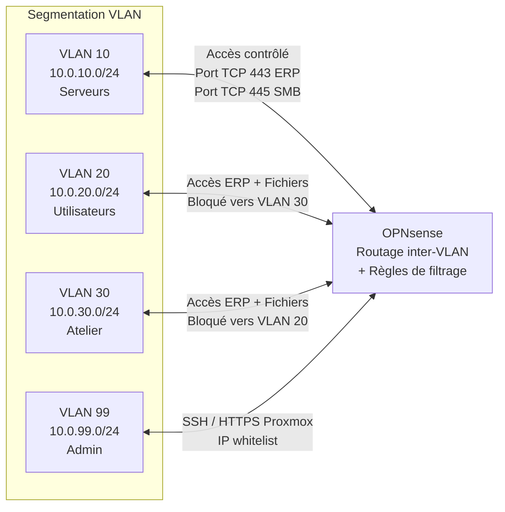
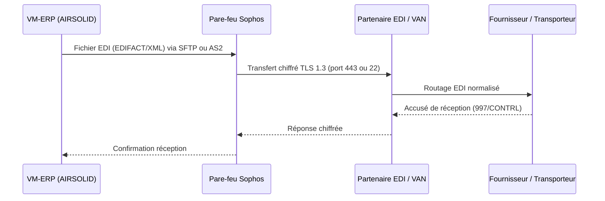
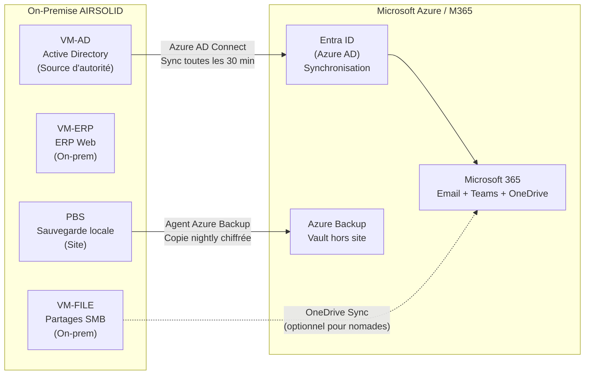
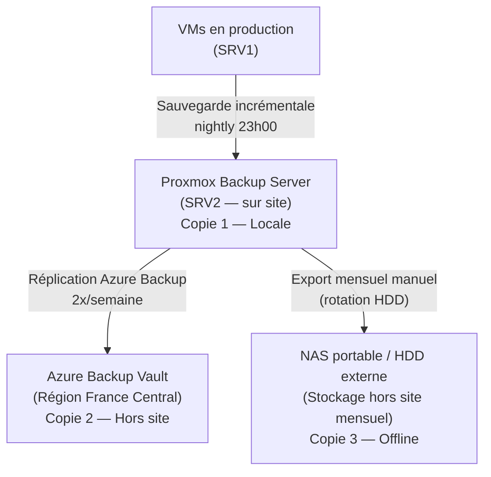

# 02 — Architecture proposée

## 2.1 Principes directeurs

L'architecture retenue repose sur cinq axes :

1. **Élimination du SPOF** — deux serveurs physiques avec réplication automatique des VMs
2. **Virtualisation type 1** — Proxmox VE sur bare-metal, isolation des services en VMs dédiées
3. **Hybride maîtrisé** — Active Directory on-premise répliqué dans le cloud, messagerie et collaboration via Microsoft 365
4. **Défense en profondeur** — segmentation VLAN, pare-feu, VPN modernes, sauvegardes hors site
---

## 2.2 Vue d'ensemble de l'architecture cible

```
<?xml version="1.0" encoding="UTF-8"?>
<!-- Do not edit this file with editors other than draw.io -->
<!DOCTYPE svg PUBLIC "-//W3C//DTD SVG 1.1//EN" "http://www.w3.org/Graphics/SVG/1.1/DTD/svg11.dtd">
<svg xmlns="http://www.w3.org/2000/svg" style="background: transparent; background-color: transparent; color-scheme: light dark;" xmlns:xlink="http://www.w3.org/1999/xlink" version="1.1" width="1581px" height="1521px" viewBox="0 0 1581 1521" content="&lt;mxfile host=&quot;app.diagrams.net&quot; agent=&quot;5.0 (Windows NT 10.0; Win64; x64) AppleWebKit/537.36 (KHTML, like Gecko) Chrome/90.0.4430.212 Safari/537.36&quot;&gt;&#xA;  &lt;diagram name=&quot;Page-1&quot; id=&quot;c37626ed-c26b-45fb-9056-f9ebc6bb27b6&quot;&gt;&#xA;    &lt;mxGraphModel dx=&quot;1742&quot; dy=&quot;-1072&quot; grid=&quot;1&quot; gridSize=&quot;10&quot; guides=&quot;1&quot; tooltips=&quot;1&quot; connect=&quot;1&quot; arrows=&quot;1&quot; fold=&quot;1&quot; page=&quot;1&quot; pageScale=&quot;1&quot; pageWidth=&quot;1100&quot; pageHeight=&quot;850&quot; background=&quot;none&quot; math=&quot;0&quot; shadow=&quot;0&quot;&gt;&#xA;      &lt;root&gt;&#xA;        &lt;mxCell id=&quot;0&quot; /&gt;&#xA;        &lt;mxCell id=&quot;1&quot; parent=&quot;0&quot; /&gt;&#xA;        &lt;mxCell id=&quot;mcNhjFotU_mfGPfnq_DX-48&quot; parent=&quot;1&quot; style=&quot;rounded=1;whiteSpace=wrap;html=1;fillColor=#d5e8d4;strokeColor=#82b366;&quot; value=&quot;&quot; vertex=&quot;1&quot;&gt;&#xA;          &lt;mxGeometry height=&quot;870&quot; width=&quot;297&quot; x=&quot;280&quot; y=&quot;3010&quot; as=&quot;geometry&quot; /&gt;&#xA;        &lt;/mxCell&gt;&#xA;        &lt;mxCell id=&quot;mcNhjFotU_mfGPfnq_DX-49&quot; parent=&quot;1&quot; style=&quot;rounded=1;whiteSpace=wrap;html=1;fillColor=#dae8fc;strokeColor=#6c8ebf;&quot; value=&quot;&quot; vertex=&quot;1&quot;&gt;&#xA;          &lt;mxGeometry height=&quot;290&quot; width=&quot;1300&quot; x=&quot;487.5&quot; y=&quot;4130&quot; as=&quot;geometry&quot; /&gt;&#xA;        &lt;/mxCell&gt;&#xA;        &lt;mxCell id=&quot;mcNhjFotU_mfGPfnq_DX-51&quot; parent=&quot;1&quot; style=&quot;rounded=1;whiteSpace=wrap;html=1;fillColor=#f8cecc;strokeColor=#b85450;&quot; value=&quot;&quot; vertex=&quot;1&quot;&gt;&#xA;          &lt;mxGeometry height=&quot;180&quot; width=&quot;250&quot; x=&quot;1012&quot; y=&quot;3170&quot; as=&quot;geometry&quot; /&gt;&#xA;        &lt;/mxCell&gt;&#xA;        &lt;mxCell id=&quot;mcNhjFotU_mfGPfnq_DX-52&quot; parent=&quot;1&quot; style=&quot;rounded=1;whiteSpace=wrap;html=1;fillColor=#fff2cc;strokeColor=#d6b656;&quot; value=&quot;&quot; vertex=&quot;1&quot;&gt;&#xA;          &lt;mxGeometry height=&quot;180&quot; width=&quot;260&quot; x=&quot;1012&quot; y=&quot;3390&quot; as=&quot;geometry&quot; /&gt;&#xA;        &lt;/mxCell&gt;&#xA;        &lt;mxCell id=&quot;mcNhjFotU_mfGPfnq_DX-53&quot; parent=&quot;1&quot; style=&quot;strokeColor=#ffffff;sketch=0;html=1;pointerEvents=1;dashed=0;fillColor=#036897;strokeWidth=2;verticalLabelPosition=bottom;verticalAlign=top;align=center;outlineConnect=0;shape=mxgraph.cisco.switches.atm_fast_gigabit_etherswitch;&quot; value=&quot;&quot; vertex=&quot;1&quot;&gt;&#xA;          &lt;mxGeometry height=&quot;84&quot; width=&quot;90&quot; x=&quot;1036&quot; y=&quot;3430&quot; as=&quot;geometry&quot; /&gt;&#xA;        &lt;/mxCell&gt;&#xA;        &lt;mxCell id=&quot;mcNhjFotU_mfGPfnq_DX-54&quot; parent=&quot;1&quot; style=&quot;strokeColor=#ffffff;sketch=0;html=1;pointerEvents=1;dashed=0;fillColor=#036897;strokeWidth=2;verticalLabelPosition=bottom;verticalAlign=top;align=center;outlineConnect=0;shape=mxgraph.cisco.switches.atm_fast_gigabit_etherswitch;&quot; value=&quot;&quot; vertex=&quot;1&quot;&gt;&#xA;          &lt;mxGeometry height=&quot;84&quot; width=&quot;90&quot; x=&quot;1154.5&quot; y=&quot;3430&quot; as=&quot;geometry&quot; /&gt;&#xA;        &lt;/mxCell&gt;&#xA;        &lt;mxCell id=&quot;mcNhjFotU_mfGPfnq_DX-55&quot; parent=&quot;1&quot; style=&quot;strokeColor=#ffffff;sketch=0;html=1;pointerEvents=1;dashed=0;fillColor=#036897;strokeWidth=2;verticalLabelPosition=bottom;verticalAlign=top;align=center;outlineConnect=0;shape=mxgraph.cisco.security.firewall;&quot; value=&quot;&quot; vertex=&quot;1&quot;&gt;&#xA;          &lt;mxGeometry height=&quot;90&quot; width=&quot;59&quot; x=&quot;1037.5&quot; y=&quot;3240&quot; as=&quot;geometry&quot; /&gt;&#xA;        &lt;/mxCell&gt;&#xA;        &lt;mxCell id=&quot;mcNhjFotU_mfGPfnq_DX-56&quot; parent=&quot;1&quot; style=&quot;strokeColor=#ffffff;sketch=0;html=1;pointerEvents=1;dashed=0;fillColor=#036897;strokeWidth=2;verticalLabelPosition=bottom;verticalAlign=top;align=center;outlineConnect=0;shape=mxgraph.cisco.security.firewall;&quot; value=&quot;&quot; vertex=&quot;1&quot;&gt;&#xA;          &lt;mxGeometry height=&quot;90&quot; width=&quot;59&quot; x=&quot;1185.5&quot; y=&quot;3240&quot; as=&quot;geometry&quot; /&gt;&#xA;        &lt;/mxCell&gt;&#xA;        &lt;mxCell id=&quot;mcNhjFotU_mfGPfnq_DX-57&quot; parent=&quot;1&quot; style=&quot;ellipse;shape=cloud;whiteSpace=wrap;html=1;rounded=0;shadow=0;comic=0;strokeWidth=1;fontFamily=Verdana;fontSize=12;&quot; value=&quot;&amp;lt;font style=&amp;quot;font-size: 16px;&amp;quot;&amp;gt;Internet&amp;lt;/font&amp;gt;&quot; vertex=&quot;1&quot;&gt;&#xA;          &lt;mxGeometry height=&quot;140&quot; width=&quot;217&quot; x=&quot;1020&quot; y=&quot;2900&quot; as=&quot;geometry&quot; /&gt;&#xA;        &lt;/mxCell&gt;&#xA;        &lt;mxCell id=&quot;mcNhjFotU_mfGPfnq_DX-58&quot; edge=&quot;1&quot; parent=&quot;1&quot; source=&quot;mcNhjFotU_mfGPfnq_DX-53&quot; style=&quot;endArrow=none;html=1;rounded=0;entryX=0.5;entryY=1;entryDx=0;entryDy=0;entryPerimeter=0;exitX=0.5;exitY=0;exitDx=0;exitDy=0;exitPerimeter=0;strokeWidth=3;&quot; target=&quot;mcNhjFotU_mfGPfnq_DX-56&quot; value=&quot;&quot;&gt;&#xA;          &lt;mxGeometry height=&quot;50&quot; relative=&quot;1&quot; width=&quot;50&quot; as=&quot;geometry&quot;&gt;&#xA;            &lt;mxPoint x=&quot;1122&quot; y=&quot;3500&quot; as=&quot;sourcePoint&quot; /&gt;&#xA;            &lt;mxPoint x=&quot;1172&quot; y=&quot;3450&quot; as=&quot;targetPoint&quot; /&gt;&#xA;          &lt;/mxGeometry&gt;&#xA;        &lt;/mxCell&gt;&#xA;        &lt;mxCell id=&quot;mcNhjFotU_mfGPfnq_DX-59&quot; edge=&quot;1&quot; parent=&quot;1&quot; source=&quot;mcNhjFotU_mfGPfnq_DX-54&quot; style=&quot;endArrow=none;html=1;rounded=0;entryX=0.5;entryY=1;entryDx=0;entryDy=0;entryPerimeter=0;exitX=0.5;exitY=0;exitDx=0;exitDy=0;exitPerimeter=0;strokeWidth=3;&quot; target=&quot;mcNhjFotU_mfGPfnq_DX-55&quot; value=&quot;&quot;&gt;&#xA;          &lt;mxGeometry height=&quot;50&quot; relative=&quot;1&quot; width=&quot;50&quot; as=&quot;geometry&quot;&gt;&#xA;            &lt;mxPoint x=&quot;1492&quot; y=&quot;3470&quot; as=&quot;sourcePoint&quot; /&gt;&#xA;            &lt;mxPoint x=&quot;1640&quot; y=&quot;3370&quot; as=&quot;targetPoint&quot; /&gt;&#xA;          &lt;/mxGeometry&gt;&#xA;        &lt;/mxCell&gt;&#xA;        &lt;mxCell id=&quot;mcNhjFotU_mfGPfnq_DX-60&quot; edge=&quot;1&quot; parent=&quot;1&quot; source=&quot;mcNhjFotU_mfGPfnq_DX-53&quot; style=&quot;endArrow=none;html=1;rounded=0;entryX=0;entryY=0.5;entryDx=0;entryDy=0;entryPerimeter=0;exitX=1;exitY=0.5;exitDx=0;exitDy=0;exitPerimeter=0;strokeWidth=3;&quot; target=&quot;mcNhjFotU_mfGPfnq_DX-54&quot; value=&quot;&quot;&gt;&#xA;          &lt;mxGeometry height=&quot;50&quot; relative=&quot;1&quot; width=&quot;50&quot; as=&quot;geometry&quot;&gt;&#xA;            &lt;mxPoint x=&quot;1452&quot; y=&quot;3440&quot; as=&quot;sourcePoint&quot; /&gt;&#xA;            &lt;mxPoint x=&quot;1600&quot; y=&quot;3340&quot; as=&quot;targetPoint&quot; /&gt;&#xA;          &lt;/mxGeometry&gt;&#xA;        &lt;/mxCell&gt;&#xA;        &lt;mxCell id=&quot;mcNhjFotU_mfGPfnq_DX-61&quot; edge=&quot;1&quot; parent=&quot;1&quot; source=&quot;mcNhjFotU_mfGPfnq_DX-53&quot; style=&quot;endArrow=none;html=1;rounded=0;entryX=0.5;entryY=1;entryDx=0;entryDy=0;entryPerimeter=0;exitX=0.5;exitY=0;exitDx=0;exitDy=0;exitPerimeter=0;strokeWidth=3;&quot; target=&quot;mcNhjFotU_mfGPfnq_DX-55&quot; value=&quot;&quot;&gt;&#xA;          &lt;mxGeometry height=&quot;50&quot; relative=&quot;1&quot; width=&quot;50&quot; as=&quot;geometry&quot;&gt;&#xA;            &lt;mxPoint x=&quot;1152&quot; y=&quot;3410&quot; as=&quot;sourcePoint&quot; /&gt;&#xA;            &lt;mxPoint x=&quot;1300&quot; y=&quot;3310&quot; as=&quot;targetPoint&quot; /&gt;&#xA;          &lt;/mxGeometry&gt;&#xA;        &lt;/mxCell&gt;&#xA;        &lt;mxCell id=&quot;mcNhjFotU_mfGPfnq_DX-62&quot; edge=&quot;1&quot; parent=&quot;1&quot; source=&quot;mcNhjFotU_mfGPfnq_DX-54&quot; style=&quot;endArrow=none;html=1;rounded=0;entryX=0.5;entryY=1;entryDx=0;entryDy=0;entryPerimeter=0;exitX=0.5;exitY=0;exitDx=0;exitDy=0;exitPerimeter=0;strokeWidth=3;&quot; target=&quot;mcNhjFotU_mfGPfnq_DX-56&quot; value=&quot;&quot;&gt;&#xA;          &lt;mxGeometry height=&quot;50&quot; relative=&quot;1&quot; width=&quot;50&quot; as=&quot;geometry&quot;&gt;&#xA;            &lt;mxPoint x=&quot;1422&quot; y=&quot;3430&quot; as=&quot;sourcePoint&quot; /&gt;&#xA;            &lt;mxPoint x=&quot;1570&quot; y=&quot;3330&quot; as=&quot;targetPoint&quot; /&gt;&#xA;          &lt;/mxGeometry&gt;&#xA;        &lt;/mxCell&gt;&#xA;        &lt;mxCell id=&quot;mcNhjFotU_mfGPfnq_DX-63&quot; edge=&quot;1&quot; parent=&quot;1&quot; source=&quot;mcNhjFotU_mfGPfnq_DX-55&quot; style=&quot;endArrow=none;html=1;rounded=0;entryX=0;entryY=0.5;entryDx=0;entryDy=0;entryPerimeter=0;exitX=1;exitY=0.5;exitDx=0;exitDy=0;exitPerimeter=0;strokeWidth=3;&quot; target=&quot;mcNhjFotU_mfGPfnq_DX-56&quot; value=&quot;&quot;&gt;&#xA;          &lt;mxGeometry height=&quot;50&quot; relative=&quot;1&quot; width=&quot;50&quot; as=&quot;geometry&quot;&gt;&#xA;            &lt;mxPoint x=&quot;1382&quot; y=&quot;3370&quot; as=&quot;sourcePoint&quot; /&gt;&#xA;            &lt;mxPoint x=&quot;1530&quot; y=&quot;3270&quot; as=&quot;targetPoint&quot; /&gt;&#xA;          &lt;/mxGeometry&gt;&#xA;        &lt;/mxCell&gt;&#xA;        &lt;mxCell id=&quot;mcNhjFotU_mfGPfnq_DX-64&quot; edge=&quot;1&quot; parent=&quot;1&quot; source=&quot;mcNhjFotU_mfGPfnq_DX-55&quot; style=&quot;endArrow=none;html=1;rounded=0;entryX=0.55;entryY=0.95;entryDx=0;entryDy=0;entryPerimeter=0;exitX=0.5;exitY=0;exitDx=0;exitDy=0;exitPerimeter=0;strokeWidth=3;&quot; target=&quot;mcNhjFotU_mfGPfnq_DX-57&quot; value=&quot;&quot;&gt;&#xA;          &lt;mxGeometry height=&quot;50&quot; relative=&quot;1&quot; width=&quot;50&quot; as=&quot;geometry&quot;&gt;&#xA;            &lt;mxPoint x=&quot;1457&quot; y=&quot;3260&quot; as=&quot;sourcePoint&quot; /&gt;&#xA;            &lt;mxPoint x=&quot;1605&quot; y=&quot;3160&quot; as=&quot;targetPoint&quot; /&gt;&#xA;          &lt;/mxGeometry&gt;&#xA;        &lt;/mxCell&gt;&#xA;        &lt;mxCell id=&quot;mcNhjFotU_mfGPfnq_DX-65&quot; edge=&quot;1&quot; parent=&quot;1&quot; source=&quot;mcNhjFotU_mfGPfnq_DX-56&quot; style=&quot;endArrow=none;html=1;rounded=0;entryX=0.55;entryY=0.95;entryDx=0;entryDy=0;entryPerimeter=0;exitX=0.5;exitY=0;exitDx=0;exitDy=0;exitPerimeter=0;strokeWidth=3;&quot; target=&quot;mcNhjFotU_mfGPfnq_DX-57&quot; value=&quot;&quot;&gt;&#xA;          &lt;mxGeometry height=&quot;50&quot; relative=&quot;1&quot; width=&quot;50&quot; as=&quot;geometry&quot;&gt;&#xA;            &lt;mxPoint x=&quot;1037&quot; y=&quot;3270&quot; as=&quot;sourcePoint&quot; /&gt;&#xA;            &lt;mxPoint x=&quot;1185&quot; y=&quot;3170&quot; as=&quot;targetPoint&quot; /&gt;&#xA;          &lt;/mxGeometry&gt;&#xA;        &lt;/mxCell&gt;&#xA;        &lt;mxCell id=&quot;mcNhjFotU_mfGPfnq_DX-66&quot; parent=&quot;1&quot; style=&quot;sketch=0;html=1;pointerEvents=1;dashed=0;fillColor=#036897;strokeColor=#ffffff;strokeWidth=2;verticalLabelPosition=bottom;verticalAlign=top;align=center;outlineConnect=0;shape=mxgraph.cisco.computers_and_peripherals.pc;&quot; value=&quot;&quot; vertex=&quot;1&quot;&gt;&#xA;          &lt;mxGeometry height=&quot;110&quot; width=&quot;110&quot; x=&quot;370.76&quot; y=&quot;3070&quot; as=&quot;geometry&quot; /&gt;&#xA;        &lt;/mxCell&gt;&#xA;        &lt;mxCell id=&quot;mcNhjFotU_mfGPfnq_DX-68&quot; parent=&quot;1&quot; style=&quot;sketch=0;html=1;pointerEvents=1;dashed=0;fillColor=#036897;strokeColor=#ffffff;strokeWidth=2;verticalLabelPosition=bottom;verticalAlign=top;align=center;outlineConnect=0;shape=mxgraph.cisco.computers_and_peripherals.pc;&quot; value=&quot;&quot; vertex=&quot;1&quot;&gt;&#xA;          &lt;mxGeometry height=&quot;110&quot; width=&quot;111.69&quot; x=&quot;369.07&quot; y=&quot;3350&quot; as=&quot;geometry&quot; /&gt;&#xA;        &lt;/mxCell&gt;&#xA;        &lt;mxCell id=&quot;mcNhjFotU_mfGPfnq_DX-73&quot; parent=&quot;1&quot; style=&quot;sketch=0;html=1;pointerEvents=1;dashed=0;fillColor=#036897;strokeColor=#ffffff;strokeWidth=2;verticalLabelPosition=bottom;verticalAlign=top;align=center;outlineConnect=0;shape=mxgraph.cisco.computers_and_peripherals.pc;&quot; value=&quot;&quot; vertex=&quot;1&quot;&gt;&#xA;          &lt;mxGeometry height=&quot;110&quot; width=&quot;110&quot; x=&quot;369.07&quot; y=&quot;3640&quot; as=&quot;geometry&quot; /&gt;&#xA;        &lt;/mxCell&gt;&#xA;        &lt;mxCell id=&quot;mcNhjFotU_mfGPfnq_DX-76&quot; parent=&quot;1&quot; style=&quot;strokeColor=#ffffff;sketch=0;html=1;pointerEvents=1;dashed=0;fillColor=#036897;strokeWidth=2;verticalLabelPosition=bottom;verticalAlign=top;align=center;outlineConnect=0;shape=mxgraph.cisco.servers.fileserver;&quot; value=&quot;&quot; vertex=&quot;1&quot;&gt;&#xA;          &lt;mxGeometry height=&quot;125&quot; width=&quot;89.5&quot; x=&quot;580&quot; y=&quot;4190&quot; as=&quot;geometry&quot; /&gt;&#xA;        &lt;/mxCell&gt;&#xA;        &lt;mxCell id=&quot;mcNhjFotU_mfGPfnq_DX-77&quot; parent=&quot;1&quot; style=&quot;strokeColor=#ffffff;sketch=0;html=1;pointerEvents=1;dashed=0;fillColor=#036897;strokeWidth=2;verticalLabelPosition=bottom;verticalAlign=top;align=center;outlineConnect=0;shape=mxgraph.cisco.servers.fileserver;&quot; value=&quot;&quot; vertex=&quot;1&quot;&gt;&#xA;          &lt;mxGeometry height=&quot;125&quot; width=&quot;89.5&quot; x=&quot;790&quot; y=&quot;4190&quot; as=&quot;geometry&quot; /&gt;&#xA;        &lt;/mxCell&gt;&#xA;        &lt;mxCell id=&quot;mcNhjFotU_mfGPfnq_DX-80&quot; parent=&quot;1&quot; style=&quot;strokeColor=#ffffff;sketch=0;html=1;pointerEvents=1;dashed=0;fillColor=#036897;strokeWidth=2;verticalLabelPosition=bottom;verticalAlign=top;align=center;outlineConnect=0;shape=mxgraph.cisco.storage.file_cabinet;&quot; value=&quot;&quot; vertex=&quot;1&quot;&gt;&#xA;          &lt;mxGeometry height=&quot;130&quot; width=&quot;92&quot; x=&quot;999.75&quot; y=&quot;3830&quot; as=&quot;geometry&quot; /&gt;&#xA;        &lt;/mxCell&gt;&#xA;        &lt;mxCell id=&quot;mcNhjFotU_mfGPfnq_DX-105&quot; edge=&quot;1&quot; parent=&quot;1&quot; source=&quot;mcNhjFotU_mfGPfnq_DX-80&quot; style=&quot;rounded=0;orthogonalLoop=1;jettySize=auto;html=1;entryX=0.5;entryY=1;entryDx=0;entryDy=0;entryPerimeter=0;strokeWidth=3;startArrow=classic;startFill=1;exitX=0.5;exitY=0;exitDx=0;exitDy=0;exitPerimeter=0;&quot; target=&quot;mcNhjFotU_mfGPfnq_DX-54&quot;&gt;&#xA;          &lt;mxGeometry relative=&quot;1&quot; as=&quot;geometry&quot; /&gt;&#xA;        &lt;/mxCell&gt;&#xA;        &lt;mxCell id=&quot;mcNhjFotU_mfGPfnq_DX-106&quot; edge=&quot;1&quot; parent=&quot;1&quot; source=&quot;mcNhjFotU_mfGPfnq_DX-80&quot; style=&quot;rounded=0;orthogonalLoop=1;jettySize=auto;html=1;exitX=0.5;exitY=0;exitDx=0;exitDy=0;exitPerimeter=0;entryX=0.5;entryY=1;entryDx=0;entryDy=0;entryPerimeter=0;strokeWidth=3;startArrow=classic;startFill=1;&quot; target=&quot;mcNhjFotU_mfGPfnq_DX-53&quot;&gt;&#xA;          &lt;mxGeometry relative=&quot;1&quot; as=&quot;geometry&quot; /&gt;&#xA;        &lt;/mxCell&gt;&#xA;        &lt;mxCell id=&quot;mcNhjFotU_mfGPfnq_DX-97&quot; edge=&quot;1&quot; parent=&quot;1&quot; source=&quot;mcNhjFotU_mfGPfnq_DX-54&quot; style=&quot;rounded=0;orthogonalLoop=1;jettySize=auto;html=1;exitX=0.5;exitY=1;exitDx=0;exitDy=0;entryX=0.861;entryY=-0.017;entryDx=0;entryDy=0;strokeWidth=3;exitPerimeter=0;startArrow=classic;startFill=1;entryPerimeter=0;&quot; target=&quot;mcNhjFotU_mfGPfnq_DX-49&quot;&gt;&#xA;          &lt;mxGeometry relative=&quot;1&quot; as=&quot;geometry&quot; /&gt;&#xA;        &lt;/mxCell&gt;&#xA;        &lt;mxCell id=&quot;mcNhjFotU_mfGPfnq_DX-96&quot; edge=&quot;1&quot; parent=&quot;1&quot; source=&quot;mcNhjFotU_mfGPfnq_DX-53&quot; style=&quot;rounded=0;orthogonalLoop=1;jettySize=auto;html=1;exitX=0.5;exitY=1;exitDx=0;exitDy=0;strokeWidth=3;exitPerimeter=0;startArrow=classic;startFill=1;entryX=0.129;entryY=0.007;entryDx=0;entryDy=0;entryPerimeter=0;&quot; target=&quot;mcNhjFotU_mfGPfnq_DX-49&quot;&gt;&#xA;          &lt;mxGeometry relative=&quot;1&quot; as=&quot;geometry&quot;&gt;&#xA;            &lt;mxPoint x=&quot;740&quot; y=&quot;3910&quot; as=&quot;targetPoint&quot; /&gt;&#xA;          &lt;/mxGeometry&gt;&#xA;        &lt;/mxCell&gt;&#xA;        &lt;mxCell id=&quot;mcNhjFotU_mfGPfnq_DX-112&quot; edge=&quot;1&quot; parent=&quot;1&quot; source=&quot;mcNhjFotU_mfGPfnq_DX-66&quot; style=&quot;rounded=0;orthogonalLoop=1;jettySize=auto;html=1;exitX=0.83;exitY=0.5;exitDx=0;exitDy=0;exitPerimeter=0;entryX=0.16;entryY=0.55;entryDx=0;entryDy=0;entryPerimeter=0;dashed=1;strokeWidth=3;startArrow=classic;startFill=1;&quot; target=&quot;mcNhjFotU_mfGPfnq_DX-57&quot;&gt;&#xA;          &lt;mxGeometry relative=&quot;1&quot; as=&quot;geometry&quot; /&gt;&#xA;        &lt;/mxCell&gt;&#xA;        &lt;mxCell id=&quot;mcNhjFotU_mfGPfnq_DX-114&quot; parent=&quot;1&quot; style=&quot;text;html=1;whiteSpace=wrap;strokeColor=none;fillColor=none;align=center;verticalAlign=middle;rounded=0;rotation=-15;&quot; value=&quot;&amp;lt;font style=&amp;quot;font-size: 22px;&amp;quot;&amp;gt;VPN&amp;lt;/font&amp;gt;&quot; vertex=&quot;1&quot;&gt;&#xA;          &lt;mxGeometry height=&quot;30&quot; width=&quot;60&quot; x=&quot;700&quot; y=&quot;3010&quot; as=&quot;geometry&quot; /&gt;&#xA;        &lt;/mxCell&gt;&#xA;        &lt;mxCell id=&quot;mcNhjFotU_mfGPfnq_DX-122&quot; edge=&quot;1&quot; parent=&quot;1&quot; source=&quot;mcNhjFotU_mfGPfnq_DX-121&quot; style=&quot;rounded=0;orthogonalLoop=1;jettySize=auto;html=1;exitX=0.5;exitY=0;exitDx=0;exitDy=0;exitPerimeter=0;startArrow=classic;startFill=1;strokeWidth=3;entryX=0.5;entryY=1;entryDx=0;entryDy=0;entryPerimeter=0;&quot; target=&quot;mcNhjFotU_mfGPfnq_DX-53&quot;&gt;&#xA;          &lt;mxGeometry relative=&quot;1&quot; as=&quot;geometry&quot; /&gt;&#xA;        &lt;/mxCell&gt;&#xA;        &lt;mxCell id=&quot;mcNhjFotU_mfGPfnq_DX-121&quot; parent=&quot;1&quot; style=&quot;strokeColor=#ffffff;sketch=0;html=1;pointerEvents=1;dashed=0;fillColor=#036897;strokeWidth=2;verticalLabelPosition=bottom;verticalAlign=top;align=center;outlineConnect=0;shape=mxgraph.cisco.storage.diskette;&quot; value=&quot;&quot; vertex=&quot;1&quot;&gt;&#xA;          &lt;mxGeometry height=&quot;110&quot; width=&quot;107&quot; x=&quot;1178.5&quot; y=&quot;3830&quot; as=&quot;geometry&quot; /&gt;&#xA;        &lt;/mxCell&gt;&#xA;        &lt;mxCell id=&quot;mcNhjFotU_mfGPfnq_DX-123&quot; edge=&quot;1&quot; parent=&quot;1&quot; source=&quot;mcNhjFotU_mfGPfnq_DX-54&quot; style=&quot;rounded=0;orthogonalLoop=1;jettySize=auto;html=1;exitX=0.5;exitY=1;exitDx=0;exitDy=0;exitPerimeter=0;entryX=0.5;entryY=0;entryDx=0;entryDy=0;entryPerimeter=0;startArrow=classic;startFill=1;strokeWidth=3;&quot; target=&quot;mcNhjFotU_mfGPfnq_DX-121&quot;&gt;&#xA;          &lt;mxGeometry relative=&quot;1&quot; as=&quot;geometry&quot; /&gt;&#xA;        &lt;/mxCell&gt;&#xA;        &lt;mxCell id=&quot;mcNhjFotU_mfGPfnq_DX-125&quot; parent=&quot;1&quot; style=&quot;text;html=1;whiteSpace=wrap;strokeColor=none;fillColor=none;align=center;verticalAlign=middle;rounded=0;&quot; value=&quot;&amp;lt;div&amp;gt;&amp;lt;font style=&amp;quot;font-size: 18px;&amp;quot;&amp;gt;Postes Ateliers SAV&amp;lt;/font&amp;gt;&amp;lt;/div&amp;gt;&amp;lt;div&amp;gt;&amp;lt;font style=&amp;quot;font-size: 18px;&amp;quot;&amp;gt;VLAN 30&amp;lt;/font&amp;gt;&amp;lt;/div&amp;gt;&quot; vertex=&quot;1&quot;&gt;&#xA;          &lt;mxGeometry height=&quot;30&quot; width=&quot;192.26&quot; x=&quot;337.74&quot; y=&quot;3484&quot; as=&quot;geometry&quot; /&gt;&#xA;        &lt;/mxCell&gt;&#xA;        &lt;mxCell id=&quot;mcNhjFotU_mfGPfnq_DX-133&quot; parent=&quot;1&quot; style=&quot;text;html=1;whiteSpace=wrap;strokeColor=none;fillColor=none;align=center;verticalAlign=middle;rounded=0;&quot; value=&quot;&amp;lt;div&amp;gt;&amp;lt;font style=&amp;quot;font-size: 19px;&amp;quot;&amp;gt;Postes Bureau&amp;lt;/font&amp;gt;&amp;lt;/div&amp;gt;&amp;lt;div&amp;gt;&amp;lt;font style=&amp;quot;font-size: 19px;&amp;quot;&amp;gt;VLAN 20&amp;lt;/font&amp;gt;&amp;lt;/div&amp;gt;&quot; vertex=&quot;1&quot;&gt;&#xA;          &lt;mxGeometry height=&quot;30&quot; width=&quot;160&quot; x=&quot;344.07&quot; y=&quot;3780&quot; as=&quot;geometry&quot; /&gt;&#xA;        &lt;/mxCell&gt;&#xA;        &lt;mxCell id=&quot;mcNhjFotU_mfGPfnq_DX-134&quot; parent=&quot;1&quot; style=&quot;text;html=1;whiteSpace=wrap;strokeColor=none;fillColor=none;align=center;verticalAlign=middle;rounded=0;&quot; value=&quot;&amp;lt;div&amp;gt;&amp;lt;font style=&amp;quot;font-size: 18px;&amp;quot;&amp;gt;&amp;lt;br&amp;gt;&amp;lt;/font&amp;gt;&amp;lt;/div&amp;gt;&amp;lt;div&amp;gt;&amp;lt;font style=&amp;quot;font-size: 18px;&amp;quot;&amp;gt;Commerciaux Nomades&amp;lt;/font&amp;gt;&amp;lt;/div&amp;gt;&amp;lt;div&amp;gt;&amp;lt;font style=&amp;quot;font-size: 18px;&amp;quot;&amp;gt;VPN&amp;amp;nbsp;&amp;lt;/font&amp;gt;&amp;lt;/div&amp;gt;&quot; vertex=&quot;1&quot;&gt;&#xA;          &lt;mxGeometry height=&quot;30&quot; width=&quot;198.87&quot; x=&quot;329.07&quot; y=&quot;3190&quot; as=&quot;geometry&quot; /&gt;&#xA;        &lt;/mxCell&gt;&#xA;        &lt;mxCell id=&quot;mcNhjFotU_mfGPfnq_DX-137&quot; parent=&quot;1&quot; style=&quot;text;html=1;whiteSpace=wrap;strokeColor=none;fillColor=none;align=center;verticalAlign=middle;rounded=0;&quot; value=&quot;&amp;lt;font style=&amp;quot;font-size: 16px;&amp;quot;&amp;gt;&amp;lt;span class=&amp;quot;nodeLabel&amp;quot;&amp;gt;VM-AD&amp;lt;br&amp;gt;Windows Server 2025&amp;lt;br&amp;gt;AD DS + DNS + DHCP&amp;lt;/span&amp;gt;&amp;lt;/font&amp;gt;&quot; vertex=&quot;1&quot;&gt;&#xA;          &lt;mxGeometry height=&quot;30&quot; width=&quot;160&quot; x=&quot;540&quot; y=&quot;4360&quot; as=&quot;geometry&quot; /&gt;&#xA;        &lt;/mxCell&gt;&#xA;        &lt;mxCell id=&quot;mcNhjFotU_mfGPfnq_DX-138&quot; parent=&quot;1&quot; style=&quot;text;html=1;whiteSpace=wrap;strokeColor=none;fillColor=none;align=center;verticalAlign=middle;rounded=0;&quot; value=&quot;&amp;lt;font style=&amp;quot;font-size: 16px;&amp;quot;&amp;gt;&amp;lt;span class=&amp;quot;nodeLabel&amp;quot;&amp;gt;VM-ERP&amp;lt;br&amp;gt;Windows Server 2025&amp;lt;br&amp;gt;ERP Web + IIS&amp;lt;/span&amp;gt;&amp;lt;/font&amp;gt;&quot; vertex=&quot;1&quot;&gt;&#xA;          &lt;mxGeometry height=&quot;30&quot; width=&quot;166&quot; x=&quot;751.75&quot; y=&quot;4350&quot; as=&quot;geometry&quot; /&gt;&#xA;        &lt;/mxCell&gt;&#xA;        &lt;mxCell id=&quot;mcNhjFotU_mfGPfnq_DX-139&quot; parent=&quot;1&quot; style=&quot;text;html=1;whiteSpace=wrap;strokeColor=none;fillColor=none;align=center;verticalAlign=middle;rounded=0;&quot; value=&quot;&amp;lt;font style=&amp;quot;font-size: 16px;&amp;quot;&amp;gt;&amp;lt;span class=&amp;quot;nodeLabel&amp;quot;&amp;gt;VM-MONITORING&amp;lt;br&amp;gt;&amp;lt;/span&amp;gt;&amp;lt;/font&amp;gt;&amp;lt;div&amp;gt;&amp;lt;font style=&amp;quot;font-size: 16px;&amp;quot;&amp;gt;&amp;lt;span class=&amp;quot;nodeLabel&amp;quot;&amp;gt;Ubuntu 26.04&amp;amp;nbsp;&amp;lt;/span&amp;gt;&amp;lt;/font&amp;gt;&amp;lt;/div&amp;gt;&amp;lt;div&amp;gt;&amp;lt;font style=&amp;quot;font-size: 16px;&amp;quot;&amp;gt;&amp;lt;span class=&amp;quot;nodeLabel&amp;quot;&amp;gt;Prometheus + Grafana&amp;lt;/span&amp;gt;&amp;lt;/font&amp;gt;&amp;lt;/div&amp;gt;&quot; vertex=&quot;1&quot;&gt;&#xA;          &lt;mxGeometry height=&quot;30&quot; width=&quot;176&quot; x=&quot;950&quot; y=&quot;4350&quot; as=&quot;geometry&quot; /&gt;&#xA;        &lt;/mxCell&gt;&#xA;        &lt;mxCell id=&quot;mcNhjFotU_mfGPfnq_DX-142&quot; parent=&quot;1&quot; style=&quot;text;html=1;whiteSpace=wrap;strokeColor=none;fillColor=none;align=center;verticalAlign=middle;rounded=0;&quot; value=&quot;&amp;lt;font style=&amp;quot;font-size: 16px;&amp;quot;&amp;gt;VM-IMMUABILITE&amp;lt;/font&amp;gt;&quot; vertex=&quot;1&quot;&gt;&#xA;          &lt;mxGeometry height=&quot;30&quot; width=&quot;133.5&quot; x=&quot;1376.5&quot; y=&quot;4350&quot; as=&quot;geometry&quot; /&gt;&#xA;        &lt;/mxCell&gt;&#xA;        &lt;mxCell id=&quot;XMjcdYjXj8xenXY2h2ou-3&quot; parent=&quot;1&quot; style=&quot;text;html=1;whiteSpace=wrap;strokeColor=none;fillColor=none;align=center;verticalAlign=middle;rounded=0;&quot; value=&quot;&amp;lt;font style=&amp;quot;font-size: 14px;&amp;quot;&amp;gt;VEEAM&amp;lt;/font&amp;gt;&quot; vertex=&quot;1&quot;&gt;&#xA;          &lt;mxGeometry height=&quot;30&quot; width=&quot;60&quot; x=&quot;1012&quot; y=&quot;3960&quot; as=&quot;geometry&quot; /&gt;&#xA;        &lt;/mxCell&gt;&#xA;        &lt;mxCell id=&quot;XMjcdYjXj8xenXY2h2ou-5&quot; parent=&quot;1&quot; style=&quot;text;html=1;whiteSpace=wrap;strokeColor=none;fillColor=none;align=center;verticalAlign=middle;rounded=0;&quot; value=&quot;&amp;lt;font style=&amp;quot;font-size: 14px;&amp;quot;&amp;gt;NAS&amp;lt;/font&amp;gt;&quot; vertex=&quot;1&quot;&gt;&#xA;          &lt;mxGeometry height=&quot;30&quot; width=&quot;60&quot; x=&quot;1202.5&quot; y=&quot;3960&quot; as=&quot;geometry&quot; /&gt;&#xA;        &lt;/mxCell&gt;&#xA;        &lt;mxCell id=&quot;XMjcdYjXj8xenXY2h2ou-9&quot; parent=&quot;1&quot; style=&quot;text;html=1;whiteSpace=wrap;strokeColor=none;fillColor=none;align=center;verticalAlign=middle;rounded=0;strokeWidth=1;&quot; value=&quot;&amp;lt;font style=&amp;quot;font-size: 20px;&amp;quot;&amp;gt;Firewall&amp;lt;/font&amp;gt;&quot; vertex=&quot;1&quot;&gt;&#xA;          &lt;mxGeometry height=&quot;30&quot; width=&quot;60&quot; x=&quot;1107.5&quot; y=&quot;3200&quot; as=&quot;geometry&quot; /&gt;&#xA;        &lt;/mxCell&gt;&#xA;        &lt;mxCell id=&quot;XMjcdYjXj8xenXY2h2ou-10&quot; parent=&quot;1&quot; style=&quot;text;html=1;whiteSpace=wrap;strokeColor=#d79b00;fillColor=#ffe6cc;align=center;verticalAlign=middle;rounded=1;rotation=0;glass=0;shadow=1;&quot; value=&quot;&amp;lt;font style=&amp;quot;font-size: 17px;&amp;quot;&amp;gt;Replication Proxmox + Sauvegarde&amp;lt;/font&amp;gt;&quot; vertex=&quot;1&quot;&gt;&#xA;          &lt;mxGeometry height=&quot;100&quot; width=&quot;191&quot; x=&quot;790&quot; y=&quot;3960&quot; as=&quot;geometry&quot; /&gt;&#xA;        &lt;/mxCell&gt;&#xA;        &lt;mxCell id=&quot;XMjcdYjXj8xenXY2h2ou-15&quot; parent=&quot;1&quot; style=&quot;ellipse;shape=cloud;whiteSpace=wrap;html=1;rounded=0;shadow=0;comic=0;strokeWidth=1;fontFamily=Verdana;fontSize=12;&quot; value=&quot;&amp;lt;div&amp;gt;&amp;lt;font style=&amp;quot;font-size: 16px;&amp;quot;&amp;gt;&amp;lt;br&amp;gt;&amp;lt;/font&amp;gt;&amp;lt;/div&amp;gt;&amp;lt;div&amp;gt;&amp;lt;font style=&amp;quot;font-size: 16px;&amp;quot;&amp;gt;&amp;lt;br&amp;gt;&amp;lt;/font&amp;gt;&amp;lt;/div&amp;gt;&amp;lt;div&amp;gt;&amp;lt;font style=&amp;quot;font-size: 16px;&amp;quot;&amp;gt;&amp;lt;br&amp;gt;&amp;lt;/font&amp;gt;&amp;lt;/div&amp;gt;&amp;lt;div&amp;gt;&amp;lt;font style=&amp;quot;font-size: 16px;&amp;quot;&amp;gt;&amp;lt;br&amp;gt;&amp;lt;/font&amp;gt;&amp;lt;/div&amp;gt;&amp;lt;div&amp;gt;&amp;lt;font style=&amp;quot;font-size: 16px;&amp;quot;&amp;gt;&amp;lt;br&amp;gt;&amp;lt;/font&amp;gt;&amp;lt;/div&amp;gt;&amp;lt;div&amp;gt;&amp;lt;font style=&amp;quot;font-size: 16px;&amp;quot;&amp;gt;&amp;lt;br&amp;gt;&amp;lt;/font&amp;gt;&amp;lt;/div&amp;gt;&amp;lt;div&amp;gt;&amp;lt;font style=&amp;quot;font-size: 16px;&amp;quot;&amp;gt;Backup off site&amp;lt;/font&amp;gt;&amp;lt;/div&amp;gt;&quot; vertex=&quot;1&quot;&gt;&#xA;          &lt;mxGeometry height=&quot;230&quot; width=&quot;300&quot; x=&quot;1560&quot; y=&quot;3180&quot; as=&quot;geometry&quot; /&gt;&#xA;        &lt;/mxCell&gt;&#xA;        &lt;mxCell id=&quot;XMjcdYjXj8xenXY2h2ou-16&quot; parent=&quot;1&quot; style=&quot;strokeColor=#ffffff;sketch=0;html=1;pointerEvents=1;dashed=0;fillColor=#036897;strokeWidth=2;verticalLabelPosition=bottom;verticalAlign=top;align=center;outlineConnect=0;shape=mxgraph.cisco.servers.fileserver;&quot; value=&quot;&quot; vertex=&quot;1&quot;&gt;&#xA;          &lt;mxGeometry height=&quot;110&quot; width=&quot;75.5&quot; x=&quot;1680&quot; y=&quot;3230&quot; as=&quot;geometry&quot; /&gt;&#xA;        &lt;/mxCell&gt;&#xA;        &lt;mxCell id=&quot;XMjcdYjXj8xenXY2h2ou-17&quot; edge=&quot;1&quot; parent=&quot;1&quot; source=&quot;mcNhjFotU_mfGPfnq_DX-57&quot; style=&quot;rounded=0;orthogonalLoop=1;jettySize=auto;html=1;exitX=0.875;exitY=0.5;exitDx=0;exitDy=0;exitPerimeter=0;entryX=0.07;entryY=0.4;entryDx=0;entryDy=0;entryPerimeter=0;startArrow=classic;startFill=1;strokeWidth=3;&quot; target=&quot;XMjcdYjXj8xenXY2h2ou-15&quot;&gt;&#xA;          &lt;mxGeometry relative=&quot;1&quot; as=&quot;geometry&quot; /&gt;&#xA;        &lt;/mxCell&gt;&#xA;        &lt;mxCell id=&quot;XMjcdYjXj8xenXY2h2ou-18&quot; parent=&quot;1&quot; style=&quot;text;html=1;whiteSpace=wrap;strokeColor=none;fillColor=none;align=center;verticalAlign=middle;rounded=0;&quot; value=&quot;&amp;lt;div&amp;gt;&amp;lt;font style=&amp;quot;font-size: 20px;&amp;quot;&amp;gt;Serveur Physique&amp;amp;nbsp;&amp;lt;/font&amp;gt;&amp;lt;/div&amp;gt;&quot; vertex=&quot;1&quot;&gt;&#xA;          &lt;mxGeometry height=&quot;30&quot; width=&quot;200&quot; x=&quot;1037.5&quot; y=&quot;4150&quot; as=&quot;geometry&quot; /&gt;&#xA;        &lt;/mxCell&gt;&#xA;        &lt;mxCell id=&quot;XMjcdYjXj8xenXY2h2ou-19&quot; edge=&quot;1&quot; parent=&quot;1&quot; source=&quot;XMjcdYjXj8xenXY2h2ou-10&quot; style=&quot;rounded=0;orthogonalLoop=1;jettySize=auto;html=1;exitX=0.5;exitY=0;exitDx=0;exitDy=0;entryX=0;entryY=0.535;entryDx=0;entryDy=0;entryPerimeter=0;&quot; target=&quot;mcNhjFotU_mfGPfnq_DX-80&quot;&gt;&#xA;          &lt;mxGeometry relative=&quot;1&quot; as=&quot;geometry&quot; /&gt;&#xA;        &lt;/mxCell&gt;&#xA;        &lt;mxCell id=&quot;XMjcdYjXj8xenXY2h2ou-20&quot; edge=&quot;1&quot; parent=&quot;1&quot; source=&quot;XMjcdYjXj8xenXY2h2ou-10&quot; style=&quot;rounded=0;orthogonalLoop=1;jettySize=auto;html=1;exitX=0.5;exitY=1;exitDx=0;exitDy=0;entryX=0.267;entryY=0.007;entryDx=0;entryDy=0;entryPerimeter=0;&quot; target=&quot;mcNhjFotU_mfGPfnq_DX-49&quot;&gt;&#xA;          &lt;mxGeometry relative=&quot;1&quot; as=&quot;geometry&quot; /&gt;&#xA;        &lt;/mxCell&gt;&#xA;        &lt;mxCell id=&quot;XMjcdYjXj8xenXY2h2ou-21&quot; parent=&quot;1&quot; style=&quot;text;html=1;whiteSpace=wrap;strokeColor=none;fillColor=none;align=center;verticalAlign=middle;rounded=0;&quot; value=&quot;&amp;lt;font style=&amp;quot;font-size: 19px;&amp;quot;&amp;gt;Switch&amp;lt;/font&amp;gt;&quot; vertex=&quot;1&quot;&gt;&#xA;          &lt;mxGeometry height=&quot;30&quot; width=&quot;60&quot; x=&quot;1107.5&quot; y=&quot;3520&quot; as=&quot;geometry&quot; /&gt;&#xA;        &lt;/mxCell&gt;&#xA;        &lt;mxCell id=&quot;XMjcdYjXj8xenXY2h2ou-27&quot; parent=&quot;1&quot; style=&quot;text;html=1;whiteSpace=wrap;strokeColor=none;fillColor=none;align=center;verticalAlign=middle;rounded=0;&quot; value=&quot;&amp;lt;font style=&amp;quot;font-size: 16px;&amp;quot;&amp;gt;&amp;lt;span class=&amp;quot;nodeLabel&amp;quot;&amp;gt;VM-AD REP&amp;lt;br&amp;gt;Windows Server 2025&amp;lt;br&amp;gt;&amp;lt;/span&amp;gt;AD DS Replica&amp;lt;/font&amp;gt;&quot; vertex=&quot;1&quot;&gt;&#xA;          &lt;mxGeometry height=&quot;30&quot; width=&quot;167.25&quot; x=&quot;1544.13&quot; y=&quot;4350&quot; as=&quot;geometry&quot; /&gt;&#xA;        &lt;/mxCell&gt;&#xA;        &lt;mxCell id=&quot;XMjcdYjXj8xenXY2h2ou-28&quot; parent=&quot;1&quot; style=&quot;text;html=1;whiteSpace=wrap;strokeColor=none;fillColor=none;align=center;verticalAlign=middle;rounded=0;&quot; value=&quot;&amp;lt;font style=&amp;quot;font-size: 16px;&amp;quot;&amp;gt;&amp;lt;span class=&amp;quot;nodeLabel&amp;quot;&amp;gt;VM-FILE&amp;lt;br&amp;gt;&amp;lt;/span&amp;gt;&amp;lt;/font&amp;gt;&amp;lt;div&amp;gt;&amp;lt;font style=&amp;quot;font-size: 16px;&amp;quot;&amp;gt;&amp;lt;span class=&amp;quot;nodeLabel&amp;quot;&amp;gt;Windows Server 2025&amp;lt;/span&amp;gt;&amp;lt;/font&amp;gt;&amp;lt;/div&amp;gt;&amp;lt;div&amp;gt;&amp;lt;font style=&amp;quot;font-size: 16px;&amp;quot;&amp;gt;&amp;lt;span class=&amp;quot;nodeLabel&amp;quot;&amp;gt;Partage SMB + DFS&amp;lt;/span&amp;gt;&amp;lt;/font&amp;gt;&amp;lt;/div&amp;gt;&quot; vertex=&quot;1&quot;&gt;&#xA;          &lt;mxGeometry height=&quot;30&quot; width=&quot;164.75&quot; x=&quot;1164.88&quot; y=&quot;4350&quot; as=&quot;geometry&quot; /&gt;&#xA;        &lt;/mxCell&gt;&#xA;        &lt;mxCell id=&quot;XMjcdYjXj8xenXY2h2ou-29&quot; parent=&quot;1&quot; style=&quot;strokeColor=#ffffff;sketch=0;html=1;pointerEvents=1;dashed=0;fillColor=#036897;strokeWidth=2;verticalLabelPosition=bottom;verticalAlign=top;align=center;outlineConnect=0;shape=mxgraph.cisco.servers.fileserver;&quot; value=&quot;&quot; vertex=&quot;1&quot;&gt;&#xA;          &lt;mxGeometry height=&quot;125&quot; width=&quot;89.5&quot; x=&quot;997.25&quot; y=&quot;4200&quot; as=&quot;geometry&quot; /&gt;&#xA;        &lt;/mxCell&gt;&#xA;        &lt;mxCell id=&quot;XMjcdYjXj8xenXY2h2ou-30&quot; parent=&quot;1&quot; style=&quot;strokeColor=#ffffff;sketch=0;html=1;pointerEvents=1;dashed=0;fillColor=#036897;strokeWidth=2;verticalLabelPosition=bottom;verticalAlign=top;align=center;outlineConnect=0;shape=mxgraph.cisco.servers.fileserver;&quot; value=&quot;&quot; vertex=&quot;1&quot;&gt;&#xA;          &lt;mxGeometry height=&quot;125&quot; width=&quot;89.5&quot; x=&quot;1202.5&quot; y=&quot;4200&quot; as=&quot;geometry&quot; /&gt;&#xA;        &lt;/mxCell&gt;&#xA;        &lt;mxCell id=&quot;XMjcdYjXj8xenXY2h2ou-31&quot; parent=&quot;1&quot; style=&quot;strokeColor=#ffffff;sketch=0;html=1;pointerEvents=1;dashed=0;fillColor=#036897;strokeWidth=2;verticalLabelPosition=bottom;verticalAlign=top;align=center;outlineConnect=0;shape=mxgraph.cisco.servers.fileserver;&quot; value=&quot;&quot; vertex=&quot;1&quot;&gt;&#xA;          &lt;mxGeometry height=&quot;125&quot; width=&quot;89.5&quot; x=&quot;1391.25&quot; y=&quot;4205&quot; as=&quot;geometry&quot; /&gt;&#xA;        &lt;/mxCell&gt;&#xA;        &lt;mxCell id=&quot;XMjcdYjXj8xenXY2h2ou-32&quot; parent=&quot;1&quot; style=&quot;strokeColor=#ffffff;sketch=0;html=1;pointerEvents=1;dashed=0;fillColor=#036897;strokeWidth=2;verticalLabelPosition=bottom;verticalAlign=top;align=center;outlineConnect=0;shape=mxgraph.cisco.servers.fileserver;&quot; value=&quot;&quot; vertex=&quot;1&quot;&gt;&#xA;          &lt;mxGeometry height=&quot;125&quot; width=&quot;89.5&quot; x=&quot;1583&quot; y=&quot;4200&quot; as=&quot;geometry&quot; /&gt;&#xA;        &lt;/mxCell&gt;&#xA;        &lt;mxCell id=&quot;XMjcdYjXj8xenXY2h2ou-33&quot; edge=&quot;1&quot; parent=&quot;1&quot; source=&quot;mcNhjFotU_mfGPfnq_DX-52&quot; style=&quot;rounded=0;orthogonalLoop=1;jettySize=auto;html=1;exitX=0;exitY=0.5;exitDx=0;exitDy=0;entryX=1.002;entryY=0.672;entryDx=0;entryDy=0;entryPerimeter=0;strokeWidth=3;startArrow=classic;startFill=1;endArrow=none;endFill=0;&quot; target=&quot;mcNhjFotU_mfGPfnq_DX-48&quot;&gt;&#xA;          &lt;mxGeometry relative=&quot;1&quot; as=&quot;geometry&quot; /&gt;&#xA;        &lt;/mxCell&gt;&#xA;        &lt;mxCell id=&quot;XMjcdYjXj8xenXY2h2ou-34&quot; edge=&quot;1&quot; parent=&quot;1&quot; source=&quot;mcNhjFotU_mfGPfnq_DX-68&quot; style=&quot;rounded=0;orthogonalLoop=1;jettySize=auto;html=1;exitX=0.83;exitY=0.5;exitDx=0;exitDy=0;exitPerimeter=0;entryX=0.996;entryY=0.67;entryDx=0;entryDy=0;entryPerimeter=0;startArrow=classic;startFill=1;endArrow=none;endFill=0;strokeWidth=3;&quot; target=&quot;mcNhjFotU_mfGPfnq_DX-48&quot;&gt;&#xA;          &lt;mxGeometry relative=&quot;1&quot; as=&quot;geometry&quot; /&gt;&#xA;        &lt;/mxCell&gt;&#xA;        &lt;mxCell id=&quot;XMjcdYjXj8xenXY2h2ou-35&quot; edge=&quot;1&quot; parent=&quot;1&quot; source=&quot;mcNhjFotU_mfGPfnq_DX-73&quot; style=&quot;rounded=0;orthogonalLoop=1;jettySize=auto;html=1;exitX=0.83;exitY=0.5;exitDx=0;exitDy=0;exitPerimeter=0;entryX=1.009;entryY=0.67;entryDx=0;entryDy=0;entryPerimeter=0;startArrow=classic;startFill=1;endArrow=none;endFill=0;strokeWidth=3;&quot; target=&quot;mcNhjFotU_mfGPfnq_DX-48&quot;&gt;&#xA;          &lt;mxGeometry relative=&quot;1&quot; as=&quot;geometry&quot; /&gt;&#xA;        &lt;/mxCell&gt;&#xA;      &lt;/root&gt;&#xA;    &lt;/mxGraphModel&gt;&#xA;  &lt;/diagram&gt;&#xA;&lt;/mxfile&gt;&#xA;"><defs/><g><g data-cell-id="0"><g data-cell-id="1"><g data-cell-id="mcNhjFotU_mfGPfnq_DX-48"><g transform="translate(0.5,0.5)"><rect x="0" y="110" width="297" height="870" rx="44.55" ry="44.55" fill="#d5e8d4" style="fill: light-dark(rgb(213, 232, 212), rgb(31, 47, 30)); stroke: light-dark(rgb(130, 179, 102), rgb(68, 110, 44));" stroke="#82b366" pointer-events="all"/></g></g><g data-cell-id="mcNhjFotU_mfGPfnq_DX-49"><g transform="translate(0.5,0.5)"><rect x="207.5" y="1230" width="1300" height="290" rx="43.5" ry="43.5" fill="#dae8fc" style="fill: light-dark(rgb(218, 232, 252), rgb(29, 41, 59)); stroke: light-dark(rgb(108, 142, 191), rgb(92, 121, 163));" stroke="#6c8ebf" pointer-events="all"/></g></g><g data-cell-id="mcNhjFotU_mfGPfnq_DX-51"><g transform="translate(0.5,0.5)"><rect x="732" y="270" width="250" height="180" rx="27" ry="27" fill="#f8cecc" style="fill: light-dark(rgb(248, 206, 204), rgb(81, 45, 43)); stroke: light-dark(rgb(184, 84, 80), rgb(215, 129, 126));" stroke="#b85450" pointer-events="all"/></g></g><g data-cell-id="mcNhjFotU_mfGPfnq_DX-52"><g transform="translate(0.5,0.5)"><rect x="732" y="490" width="260" height="180" rx="27" ry="27" fill="#fff2cc" style="fill: light-dark(rgb(255, 242, 204), rgb(40, 29, 0)); stroke: light-dark(rgb(214, 182, 86), rgb(109, 81, 0));" stroke="#d6b656" pointer-events="all"/></g></g><g data-cell-id="mcNhjFotU_mfGPfnq_DX-53"><g transform="translate(0.5,0.5)"><rect x="756" y="530" width="90" height="84" fill="none" stroke="none" pointer-events="all"/><path d="M 823.68 614 L 823.68 548.9 L 756 548.9 L 756 614 Z M 846 530 L 823.68 548.9 L 756 548.9 L 780.55 530 Z M 846 588.8 L 846 530 L 823.68 548.9 L 823.68 614 Z" fill="#036897" style="fill: light-dark(rgb(3, 104, 151), rgb(92, 179, 220)); stroke: light-dark(rgb(255, 255, 255), rgb(18, 18, 18));" stroke="#ffffff" stroke-width="2" stroke-linejoin="round" stroke-miterlimit="10" pointer-events="all"/><rect x="756" y="530" width="0" height="0" fill="none" stroke="#ffffff" style="stroke: light-dark(rgb(255, 255, 255), rgb(18, 18, 18));" stroke-width="2" pointer-events="all"/><path d="M 768.65 599.3 L 782.78 599.3 L 802.13 561.5 L 816.25 561.5" fill="none" stroke="#000000" style="stroke: light-dark(rgb(0, 0, 0), rgb(237, 237, 237));" stroke-width="4.2" stroke-miterlimit="10" pointer-events="all"/><path d="M 811.79 554.51 L 811.79 568.49 L 820.72 561.5 Z M 770.88 606.29 L 770.88 593 L 762.69 599.3 Z" fill="#000000" style="fill: light-dark(rgb(0, 0, 0), rgb(237, 237, 237));" stroke="none" pointer-events="all"/><path d="M 768.65 607.7 L 768.65 594.41 L 760.46 600.71 Z M 810.29 555.89 L 810.29 569.21 L 819.22 562.91 Z" fill="#ffffff" style="fill: light-dark(rgb(255, 255, 255), rgb(18, 18, 18));" stroke="none" pointer-events="all"/><path d="M 770.88 568.49 L 770.88 555.2 L 762.69 561.5 Z" fill="#000000" style="fill: light-dark(rgb(0, 0, 0), rgb(237, 237, 237));" stroke="none" pointer-events="all"/><path d="M 768.65 569.9 L 768.65 556.61 L 760.46 562.91 Z" fill="#ffffff" style="fill: light-dark(rgb(255, 255, 255), rgb(18, 18, 18));" stroke="none" pointer-events="all"/><path d="M 816.25 599.3 L 802.13 599.3 L 782.04 561.5 L 770.13 561.5" fill="none" stroke="#000000" style="stroke: light-dark(rgb(0, 0, 0), rgb(237, 237, 237));" stroke-width="4.2" stroke-miterlimit="10" pointer-events="all"/><path d="M 816.25 600.71 L 801.37 600.71 L 781.28 562.91 L 765.66 562.91" fill="none" stroke="#ffffff" style="stroke: light-dark(rgb(255, 255, 255), rgb(18, 18, 18));" stroke-width="4.2" stroke-miterlimit="10" pointer-events="all"/><path d="M 765.66 600.71 L 780.55 600.71 L 799.9 562.91 L 815.52 562.91" fill="none" stroke="#ffffff" style="stroke: light-dark(rgb(255, 255, 255), rgb(18, 18, 18));" stroke-width="4.2" stroke-miterlimit="10" pointer-events="all"/><path d="M 811.79 593 L 811.79 606.29 L 820.72 599.99 Z" fill="#000000" style="fill: light-dark(rgb(0, 0, 0), rgb(237, 237, 237));" stroke="none" pointer-events="all"/><path d="M 810.29 593.69 L 810.29 607.01 L 819.22 600.71 Z" fill="#ffffff" style="fill: light-dark(rgb(255, 255, 255), rgb(18, 18, 18));" stroke="none" pointer-events="all"/><path d="M 823.68 533.51 L 826.67 531.41 L 835.6 534.2 L 819.98 537.71 L 823.68 534.2 L 808.06 534.2 L 808.82 533.51 Z" fill="#000000" style="fill: light-dark(rgb(0, 0, 0), rgb(237, 237, 237));" stroke="none" pointer-events="all"/><path d="M 811.79 541.91 L 814.76 539.81 L 822.21 541.91 L 806.59 545.39 L 809.56 542.6 L 793.94 542.6 L 796.17 541.91 Z M 804.36 536.3 L 802.86 537.71 L 790.21 537.71 L 787.24 539.09 L 779.81 536.99 L 795.43 533.51 L 790.97 536.3 Z M 793.2 544.7 L 790.97 546.11 L 778.32 546.11 L 776.08 547.49 L 768.65 544.7 L 784.27 541.91 L 779.81 544.7 Z M 823.68 534.2 L 826.67 532.1 L 834.84 534.89 L 819.22 537.71 L 821.45 535.61 L 806.59 535.61 L 808.06 534.2 Z" fill="#ffffff" style="fill: light-dark(rgb(255, 255, 255), rgb(18, 18, 18));" stroke="none" pointer-events="all"/></g></g><g data-cell-id="mcNhjFotU_mfGPfnq_DX-54"><g transform="translate(0.5,0.5)"><rect x="874.5" y="530" width="90" height="84" fill="none" stroke="none" pointer-events="all"/><path d="M 942.18 614 L 942.18 548.9 L 874.5 548.9 L 874.5 614 Z M 964.5 530 L 942.18 548.9 L 874.5 548.9 L 899.05 530 Z M 964.5 588.8 L 964.5 530 L 942.18 548.9 L 942.18 614 Z" fill="#036897" style="fill: light-dark(rgb(3, 104, 151), rgb(92, 179, 220)); stroke: light-dark(rgb(255, 255, 255), rgb(18, 18, 18));" stroke="#ffffff" stroke-width="2" stroke-linejoin="round" stroke-miterlimit="10" pointer-events="all"/><rect x="874.5" y="530" width="0" height="0" fill="none" stroke="#ffffff" style="stroke: light-dark(rgb(255, 255, 255), rgb(18, 18, 18));" stroke-width="2" pointer-events="all"/><path d="M 887.15 599.3 L 901.28 599.3 L 920.63 561.5 L 934.75 561.5" fill="none" stroke="#000000" style="stroke: light-dark(rgb(0, 0, 0), rgb(237, 237, 237));" stroke-width="4.2" stroke-miterlimit="10" pointer-events="all"/><path d="M 930.29 554.51 L 930.29 568.49 L 939.22 561.5 Z M 889.38 606.29 L 889.38 593 L 881.19 599.3 Z" fill="#000000" style="fill: light-dark(rgb(0, 0, 0), rgb(237, 237, 237));" stroke="none" pointer-events="all"/><path d="M 887.15 607.7 L 887.15 594.41 L 878.96 600.71 Z M 928.79 555.89 L 928.79 569.21 L 937.72 562.91 Z" fill="#ffffff" style="fill: light-dark(rgb(255, 255, 255), rgb(18, 18, 18));" stroke="none" pointer-events="all"/><path d="M 889.38 568.49 L 889.38 555.2 L 881.19 561.5 Z" fill="#000000" style="fill: light-dark(rgb(0, 0, 0), rgb(237, 237, 237));" stroke="none" pointer-events="all"/><path d="M 887.15 569.9 L 887.15 556.61 L 878.96 562.91 Z" fill="#ffffff" style="fill: light-dark(rgb(255, 255, 255), rgb(18, 18, 18));" stroke="none" pointer-events="all"/><path d="M 934.75 599.3 L 920.63 599.3 L 900.54 561.5 L 888.63 561.5" fill="none" stroke="#000000" style="stroke: light-dark(rgb(0, 0, 0), rgb(237, 237, 237));" stroke-width="4.2" stroke-miterlimit="10" pointer-events="all"/><path d="M 934.75 600.71 L 919.87 600.71 L 899.78 562.91 L 884.16 562.91" fill="none" stroke="#ffffff" style="stroke: light-dark(rgb(255, 255, 255), rgb(18, 18, 18));" stroke-width="4.2" stroke-miterlimit="10" pointer-events="all"/><path d="M 884.16 600.71 L 899.05 600.71 L 918.4 562.91 L 934.02 562.91" fill="none" stroke="#ffffff" style="stroke: light-dark(rgb(255, 255, 255), rgb(18, 18, 18));" stroke-width="4.2" stroke-miterlimit="10" pointer-events="all"/><path d="M 930.29 593 L 930.29 606.29 L 939.22 599.99 Z" fill="#000000" style="fill: light-dark(rgb(0, 0, 0), rgb(237, 237, 237));" stroke="none" pointer-events="all"/><path d="M 928.79 593.69 L 928.79 607.01 L 937.72 600.71 Z" fill="#ffffff" style="fill: light-dark(rgb(255, 255, 255), rgb(18, 18, 18));" stroke="none" pointer-events="all"/><path d="M 942.18 533.51 L 945.17 531.41 L 954.1 534.2 L 938.48 537.71 L 942.18 534.2 L 926.56 534.2 L 927.32 533.51 Z" fill="#000000" style="fill: light-dark(rgb(0, 0, 0), rgb(237, 237, 237));" stroke="none" pointer-events="all"/><path d="M 930.29 541.91 L 933.26 539.81 L 940.71 541.91 L 925.09 545.39 L 928.06 542.6 L 912.44 542.6 L 914.67 541.91 Z M 922.86 536.3 L 921.36 537.71 L 908.71 537.71 L 905.74 539.09 L 898.31 536.99 L 913.93 533.51 L 909.47 536.3 Z M 911.7 544.7 L 909.47 546.11 L 896.82 546.11 L 894.58 547.49 L 887.15 544.7 L 902.77 541.91 L 898.31 544.7 Z M 942.18 534.2 L 945.17 532.1 L 953.34 534.89 L 937.72 537.71 L 939.95 535.61 L 925.09 535.61 L 926.56 534.2 Z" fill="#ffffff" style="fill: light-dark(rgb(255, 255, 255), rgb(18, 18, 18));" stroke="none" pointer-events="all"/></g></g><g data-cell-id="mcNhjFotU_mfGPfnq_DX-55"><g transform="translate(0.5,0.5)"><rect x="757.5" y="340" width="59" height="90" fill="none" stroke="none" pointer-events="all"/><path d="M 757.5 430 L 757.5 355.48 L 791.22 355.48 L 791.22 430 Z M 791.22 355.48 L 757.5 355.48 L 788.06 340 L 816.5 340 Z M 816.5 340 L 816.5 411.02 L 791.22 430 L 791.22 355.48 Z" fill="#036897" style="fill: light-dark(rgb(3, 104, 151), rgb(92, 179, 220)); stroke: light-dark(rgb(255, 255, 255), rgb(18, 18, 18));" stroke="#ffffff" stroke-width="2" stroke-linejoin="round" stroke-miterlimit="10" pointer-events="all"/><path d="M 809.11 356.18 L 809.11 344.22 M 809.11 380.79 L 809.11 368.83 M 809.11 404.69 L 809.11 392.73 M 816.5 399.06 L 791.22 418.04 M 816.5 387.12 L 791.22 405.39 M 816.5 375.16 L 791.22 392.73 M 816.5 363.2 L 791.22 380.79 M 816.5 351.96 L 791.22 368.14 M 791.22 355.48 L 816.5 340 M 791.22 418.04 L 757.5 418.04 M 791.22 405.39 L 757.5 405.39 M 791.22 392.73 L 757.5 392.73 M 791.22 380.07 L 757.5 380.07 M 791.22 368.14 L 757.5 368.14 M 800.7 422.96 L 800.7 411.02 M 800.7 399.06 L 800.7 387.12 M 800.7 374.46 L 800.7 362.51" fill="none" stroke="#ffffff" style="stroke: light-dark(rgb(255, 255, 255), rgb(18, 18, 18));" stroke-width="2" stroke-linejoin="round" stroke-miterlimit="10" pointer-events="all"/></g></g><g data-cell-id="mcNhjFotU_mfGPfnq_DX-56"><g transform="translate(0.5,0.5)"><rect x="905.5" y="340" width="59" height="90" fill="none" stroke="none" pointer-events="all"/><path d="M 905.5 430 L 905.5 355.48 L 939.22 355.48 L 939.22 430 Z M 939.22 355.48 L 905.5 355.48 L 936.06 340 L 964.5 340 Z M 964.5 340 L 964.5 411.02 L 939.22 430 L 939.22 355.48 Z" fill="#036897" style="fill: light-dark(rgb(3, 104, 151), rgb(92, 179, 220)); stroke: light-dark(rgb(255, 255, 255), rgb(18, 18, 18));" stroke="#ffffff" stroke-width="2" stroke-linejoin="round" stroke-miterlimit="10" pointer-events="all"/><path d="M 957.11 356.18 L 957.11 344.22 M 957.11 380.79 L 957.11 368.83 M 957.11 404.69 L 957.11 392.73 M 964.5 399.06 L 939.22 418.04 M 964.5 387.12 L 939.22 405.39 M 964.5 375.16 L 939.22 392.73 M 964.5 363.2 L 939.22 380.79 M 964.5 351.96 L 939.22 368.14 M 939.22 355.48 L 964.5 340 M 939.22 418.04 L 905.5 418.04 M 939.22 405.39 L 905.5 405.39 M 939.22 392.73 L 905.5 392.73 M 939.22 380.07 L 905.5 380.07 M 939.22 368.14 L 905.5 368.14 M 948.7 422.96 L 948.7 411.02 M 948.7 399.06 L 948.7 387.12 M 948.7 374.46 L 948.7 362.51" fill="none" stroke="#ffffff" style="stroke: light-dark(rgb(255, 255, 255), rgb(18, 18, 18));" stroke-width="2" stroke-linejoin="round" stroke-miterlimit="10" pointer-events="all"/></g></g><g data-cell-id="mcNhjFotU_mfGPfnq_DX-57"><g transform="translate(0.5,0.5)"><path d="M 794.25 35 C 750.85 35 740 70 774.72 77 C 740 92.4 779.06 126 807.27 112 C 826.8 140 891.9 140 913.6 112 C 957 112 957 84 929.88 70 C 957 42 913.6 14 875.63 28 C 848.5 7 805.1 7 794.25 35 Z" fill="#ffffff" style="fill: light-dark(#ffffff, var(--ge-dark-color, #121212)); stroke: light-dark(rgb(0, 0, 0), rgb(255, 255, 255));" stroke="#000000" stroke-miterlimit="10" pointer-events="all"/></g><g><g><switch><foreignObject style="overflow: visible; text-align: left;" pointer-events="none" width="100%" height="100%" requiredFeatures="http://www.w3.org/TR/SVG11/feature#Extensibility"><div xmlns="http://www.w3.org/1999/xhtml" style="display: flex; align-items: unsafe center; justify-content: unsafe center; width: 215px; height: 1px; padding-top: 70px; margin-left: 741px;"><div style="box-sizing: border-box; font-size: 0; text-align: center; color: #000000; "><div style="display: inline-block; font-size: 12px; font-family: Verdana; color: light-dark(#000000, #ffffff); line-height: 1.2; pointer-events: all; white-space: normal; word-wrap: normal; "><font style="font-size: 16px;">Internet</font></div></div></div></foreignObject><text x="849" y="74" fill="light-dark(#000000, #ffffff)" font-family="Verdana" font-size="12px" text-anchor="middle">Internet</text></switch></g></g></g><g data-cell-id="mcNhjFotU_mfGPfnq_DX-58"><g><path d="M 801 530 L 935 430" fill="none" stroke="#000000" style="stroke: light-dark(rgb(0, 0, 0), rgb(255, 255, 255));" stroke-width="3" stroke-miterlimit="10" pointer-events="stroke"/></g></g><g data-cell-id="mcNhjFotU_mfGPfnq_DX-59"><g><path d="M 919.5 530 L 787 430" fill="none" stroke="#000000" style="stroke: light-dark(rgb(0, 0, 0), rgb(255, 255, 255));" stroke-width="3" stroke-miterlimit="10" pointer-events="stroke"/></g></g><g data... (55 Ko restants)
```

---

## 2.3 Composants de l'architecture

### 2.3.1 Couche physique — deux serveurs envisagés

| Paramètre | Serveur Primaire (SRV1) | Serveur Secondaire (SRV2) |
|---|---|---|
| **Modèle recommandé** | Dell PowerEdge R550 (ou HP DL380 Gen10+) | Idem |
| **Processeur** | 2x Intel Xeon Silver 4410Y (12c/24t) | 2x Intel Xeon Silver 4410Y |
| **RAM** | 128 GB DDR4 ECC | 128 GB DDR4 ECC |
| **Stockage OS** | 2x 480 GB SSD SATA (RAID 1) | 2x 480 GB SSD SATA (RAID 1) |
| **Stockage VMs** | 4x 1.92 TB NVMe (RAID 10 = 3.84 TB utile) | 4x 1.92 TB NVMe (RAID 10) |
| **Réseau** | 2x 10 GbE SFP+ + 2x 1 GbE | Idem |
| **Alimentation** | Dual PSU redondant | Dual PSU redondant |
| **Hyperviseur** | Proxmox VE 8.x | Proxmox VE 8.x |

> Les deux serveurs forment un **cluster Proxmox VE** en mode HA (High Availability). En cas de panne du nœud primaire, les VMs basculent automatiquement sur le secondaire en moins de 5 minutes.

### 2.3.2 Machines virtuelles

| VM | OS | vCPU | RAM | Stockage | Rôle |
|---|---|---|---|---|---|
| **VM-AD** | Windows Server 2022 STD | 2 | 4 GB | 80 GB | AD DS, DNS, DHCP |
| **VM-ERP** | Windows Server 2022 STD | 8 | 16 GB | 200 GB | ERP Web (IIS/SQL) |
| **VM-FILE** | Windows Server 2022 STD | 4 | 8 GB | 2 TB | Partages SMB, DFS |
| **VM-MON** | Debian 12 | 2 | 4 GB | 100 GB | Supervision (Netdata, Grafana) |
| **VM-AD-REP** | Windows Server 2022 STD | 2 | 4 GB | 80 GB | Contrôleur AD secondaire |
| **PBS** | Proxmox Backup Server | 4 | 8 GB | 4 TB | Sauvegarde locale des VMs |

**Total ressources SRV1** : 16 vCPU / 32 GB RAM alloués (capacité physique : 48 cœurs / 128 GB)
**Réserve disponible** : ~66 % CPU et 75 % RAM → marge pour l'entrepôt secondaire

### 2.3.3 Réseau — segmentation VLAN



| VLAN | Réseau | Population | Accès autorisés |
|---|---|---|---|
| **VLAN 10** | 10.0.10.0/24 | Serveurs virtuels (VMs) | Toutes VMs entre elles |
| **VLAN 20** | 10.0.20.0/24 | Postes bureautique | ERP (443), Fichiers (445/139), AD (389/636) |
| **VLAN 30** | 10.0.30.0/24 | Atelier SAV | ERP (443), Fichiers (445/139), AD — isolé de VLAN 20 |
| **VLAN 99** | 10.0.99.0/24 | Admin | SSH (22), HTTPS Proxmox (8006) — IP whitelist uniquement |

> **VPN pour 30 télétravailleurs** : 30 collaborateurs en télétravail ont été identifiés lors de l'entretien 1. Le VPN WireGuard est dimensionné pour accueillir ces 30 utilisateurs simultanés. Chaque pair dispose d'un certificat et d'un fichier de configuration individuels générés par le script de provisioning.

### 2.3.4 Flux EDI

Le client n'a pas de flux EDI existants définis. La proposition ci-dessous constitue une **architecture EDI de départ légère**, à valider avec l'éditeur ERP et les partenaires logistiques.



Les flux EDI transitent exclusivement via le pare-feu avec :
- Certificats TLS valides (Let's Encrypt ou PKI interne)
- Port source fixe et destination IP allowlistée
- Journalisation des échanges dans VM-MON

---

## 2.4 Architecture hybride on-premise / cloud



### Répartition des services

| Service | Hébergement | Justification |
|---|---|---|
| Active Directory | On-premise (VM-AD + VM-AD-REP) | Dépendance critique des postes ; latence faible requise |
| ERP web | On-premise (VM-ERP) | Spécificités métier, données sensibles, éditeur à consulter |
| Partages fichiers | On-premise (VM-FILE) | Volumes importants, accès rapide réseau local |
| Messagerie | Microsoft 365 (cloud) | Déjà en déploiement, délestage du serveur on-prem |
| Collaboration | Microsoft 365 (cloud) | Teams, SharePoint, Planner |
| Sauvegarde hors site | Azure Backup | Externalisation géographique, conformité RGPD |
| Identité cloud | Entra ID (synchronisé) | SSO unifié on-prem + cloud, MFA imposé |

---

## 2.5 Stratégie de sauvegarde 3-2-1



| Type | Fréquence | Rétention | Support |
|---|---|---|---|
| Sauvegarde incrémentale | Quotidienne (23h00) | 30 jours | PBS local (SRV2) |
| Sauvegarde hebdomadaire | Dimanche 01h00 | 12 semaines | PBS local |
| Sauvegarde mensuelle | 1er du mois | 12 mois | Azure Backup + HDD externe |
| Test de restauration | Mensuel | — | Environnement de test isolé |

---

## 2.6 Évolutivité — Site secondaire (12 mois)

L'architecture est conçue pour absorber le second dépôt prévu dans 12 mois :
- Extension du cluster Proxmox avec un 3e nœud sur le site secondaire (WAN link 1 Gb requis)
- Réplication PBS inter-sites pour les VMs critiques
- Extension du VPN site-à-site (WireGuard) entre les deux dépôts
- Active Directory Sites and Services configuré pour routing LDAP optimal

> **Extension Allemagne (site secondaire)** : la présence de collaborateurs en Allemagne nécessitera, à terme, soit un VPN site-à-site permanent (WireGuard inter-sites), soit un nœud Proxmox délocalisé sur le site allemand répliquant les VMs critiques. Cette évolution est intégrée dans la feuille de route à 12-24 mois.
